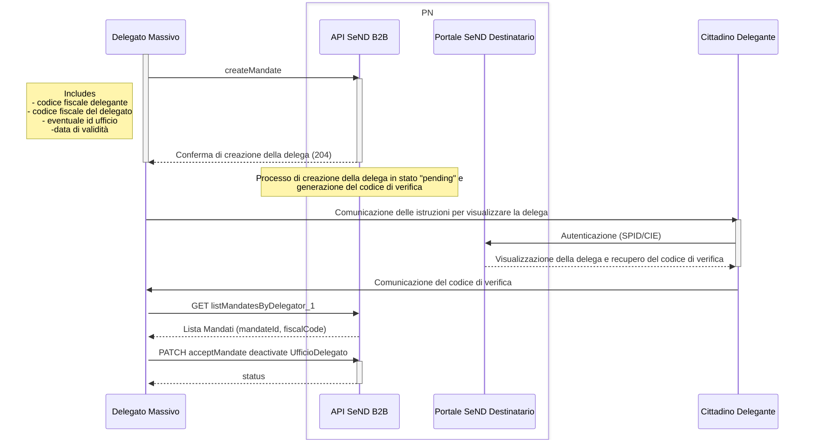
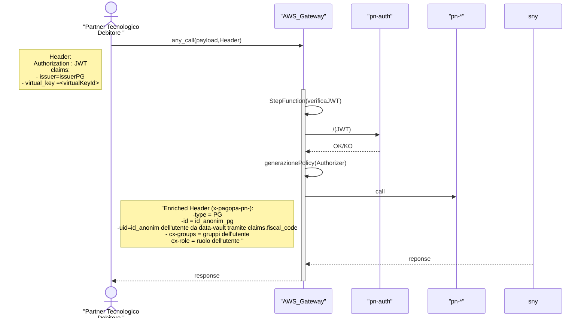

## Scenario
Una società ( persona giuridica , da qui in avanti Partner Tecnologico del Destinatario ) vuole offire un servizio gestione delle notifiche ai cittadini / pesone giuridiche accedendo tramite API alla piattaforma SEND.

Affinchè il Partner Tecnologico Destinatario possa accedere alle notifiche dei suoi clienti è necessario che quest'ultimi deleghino il Partner Tecnologico a poter accedere alle proprie notifiche 

Abbiamo quindi due Scenari : 
- Generazione della delega 
- Accesso agli atti

### Generazione della delega
Data la natura del business del Partner Tecnologico del Destinatario, la creazione della delega viene dapprima creata dal Partner Tecnologico e successivamente confermata tramite ingaggio del Cittadino.

API Utilizzate 

-  Generazione Delega ( andate-reverse-service )  :POST  /mandate/api/v1/reverse-mandate
- Accettazione Delega ( acceptMandate) : PATCH /mandate/api/v1/mandate/{mandateId}/accept
- Lettura delle deleghe (listMandatesByDelegator_1) : GET /mandate/api/v1/mandates-by-delegator:

To Be Discuss : 

- Le Api di creazione dovrebbero contenere solo fiscalCode, gli altri dati mi sembrano superflui.
- il codice di verifica viene generato dalla piattaforma ed accessibile esclusivamente dal Delegante. Attualmente è un codice statico , salvato in ..., -> forse dovrebbe essere one-shot , time-limited creato dal Cittadino direttamente sul portale.

- la delega è totale, tipicamente invece ogni Partener Tecnologico gestisce tipologia di notifica differenti ( esempio Bloomfleet è interessato a codice della strada. )

Possibili miglioramenti : 
- Le istruzioni per acquisire il codice di verifica , potrebbero essere passate tramite URL , riportando l'utente direttamente alla visualizzazione della delega. In questo modo facilitiamo 

#### Diagramma tecnico 

[Link di dettaglio](https://sequencediagram.org/index.html#initialData=KoFwpgduAEAKDiBaAfAZQJYGdwFsCG0ADgE4D2J6YIex6pc8AXNALLrR4Cu4U6AxvQERonTGGIQ8OMAHpCeTJgDupYgBMAUKEgwEAHkSIM2MPiJkKVGnQbMASmGzoQnAF50IYaACkA6gBUNCFIYUgA3cWhtKC8EABpoY1wCEnJaK1p6BEYAKhy+ABs8dBxMPMYAHQgsTE5xAF4auuIGKrD0Yhc8AoB9AGswAE96vXbOzm6AaSGesQg1ZC0eXSRkAEFYAEloeDxwJTxB5gBhAAt0KT2CDc2gkK9wyOiVhJudvbADo7zTsDw1cSYaC0PjnRzUPJVKprbinVToVx7DzQZh+fxVaCYjRvXb7Q4oHEfL6MABq4nQADN+AQAFZKEDQEDEKTOLx0vpAgAUMJAcNornEAEoNGAAB7yeZ4ABGBTAiGgaxATPQUu4XgcmFIBQixGxW3eeMGBP1uM+h0YDj4nEI4nohE4xEIpDEQLU3QKAHImpEbS0hOBRSAAHR8d3S2VrQjofx4ADmmD121NX2NSaJ5st1tt0B0zgAB9Axl0CtNBtA3T4AiGiiVMEGixNegNBomDWajesTemjmTaFTQ+WwAVPXg+HwqNR3KRPIP2P5SKhGcycKzoOgCtA+KLNmpgWArb69vQ3cOCA2pkNW8n8Z204aLfus8ziF4K6ghxTjjQvOvgZwtfQP7QLGxDWlGg7DoAmARqjES4sjAP67gCw4ejBCEQUUDB7ge4hIuWYaFh0xalle3apm2xKQCCpybtOAYgCK8ykYa5HXkcsaQLhU4zk6BT8GW3KwvCArEMKhIsbeFHmlR-A0b8-yAncoQ6gqXaGq8+qoAAogAcgAItAABCABMhm5DkWkQNRYC7vJALEJg5lVKKiDyLG5B4K5ECIFuiAgIMNrQPUDAJM5rlxh5Xk+S56C7sFsU9HgwTVDgPSELG0BhW5kWEN5nCxUFa5qIlyUlBhqHLK+BButQiBhFwBQMky8FeIUxSlEGVKYKGvQCACWURfIUW+SBpDWkCwUgWB7DIZ6aFeAN7lDbl0WIGQsqFaBAHlfNzHtuR2n6UZpknOclzUKpmxAA  ) 

[documento di test con Bloomfleet](https://drive.google.com/drive/folders/1HKa2I8lbMO2tqUX1HQf7HecOBFeVDuUD)

I microservizi impattati dovrebbero essere 
| Microservizio              | Versione   |
|----------------------------|------------|
| pn-user-attributes         | v2.8.0     |
| pn-mandate                 | v2.5.0     |
| pn-delivery                | v2.10.0    |
| pn-delivery-push           | v2.11.0    |
| pn-external-registries     | v2.8.0     |

 