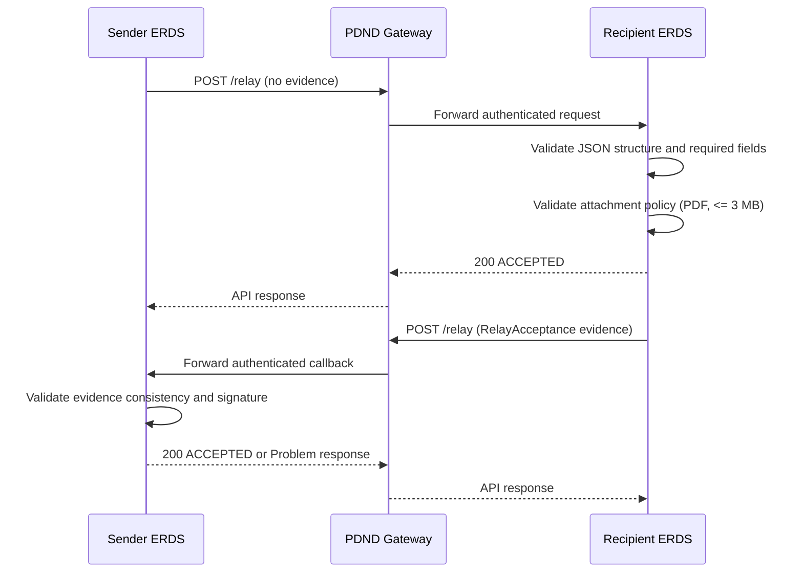

# ERDS Relay User Manual

## Scope
This manual explains how an ERDS client sends a relay message to the ERDS Relay Interface defined in [send/ipg-sercq/openapi/openapi.yml](send/ipg-sercq/openapi/openapi.yml).

Target use case in this guide:
- Send one text message
- Attach one PDF file
- Enforce maximum PDF size: 3 MB (raw file size)

## Audience
This guide is for integrators and developers implementing an ERDS sender that calls the relay endpoint.

## Endpoint Summary
- Health check: GET /status
- Relay operation: POST /relay
- Base URL template: https://{erds-domain}/pdnd/erds/v1

Example full relay URL:
- https://api.example-erds.it/pdnd/erds/v1/relay

## Security and Required Headers
You must include:
- Authorization: Bearer <PDND_VOUCHER_JWT>
- X-Correlation-ID: UUID value for end-to-end tracing
- Content-Type: application/json

Notes:
- The PDND voucher is mandatory. Missing or invalid voucher returns 401.
- If the caller is authenticated but not allowed to access the e-service, the API returns 403.

## Relay Payload Model
The POST /relay body is an ERDDispatch object with three top-level sections:
- userContent
- relayMetadata
- evidence

Think of it as a shipping package:
- userContent = what you are sending (text and attachment)
- relayMetadata = shipping label and technical manifest
- evidence = proof and signed event trail

### Operational Choreography for This Integration
This integration uses a two-step exchange over the same /relay operation:
- Step 1 (Sender -> Recipient): dispatch request without evidence
- Step 2 (Recipient -> Sender): callback dispatch that includes RelayAcceptance evidence

In simple terms:
- First call transports message content
- Second call transports acceptance proof

## PDF Attachment Rule for This Profile
The OpenAPI schema allows broad attachment types and larger content lengths, but for this ERDS usage profile apply these operational constraints:
- Exactly one attachment is allowed for this flow
- Attachment must be PDF only
- contentType must be application/pdf
- Maximum raw file size: 3 MB
- Attachment content must be Base64 encoded into Attachment.content

Important sizing detail:
- Base64 expands payload size by approximately 33%
- 3 MB raw file becomes about 4 MB encoded

## Minimal Required Fields
For this profile, required fields depend on the phase.

### Phase 1: Sender -> Recipient (No Evidence)

1. userContent
- oggetto
- testo
- allegati[0].filename
- allegati[0].contentType
- allegati[0].content (Base64)

2. relayMetadata
- MetadataVersion
- SenderId
- RecipientId
- ERDMessageType
- UserContentInfo.ComposingParts
- UserContentInfo.PartsInfo[] with:
  - Identifier
  - ContentType
  - DigestMethod
  - DigestValue

3. evidence
- Not included in Phase 1 request

### Phase 2: Recipient -> Sender (RelayAcceptance Evidence)

1. userContent
- Usually the same content profile (text + PDF reference model)

2. relayMetadata
- Include correlation to the original message (for example via MessageIdentifier)

3. evidence[0]
- EvidenceIdentifier
- EvidenceVersion
- ERDSEventId (RelayAcceptance)
- EventTime
- EvidenceIssuerDetails
- SenderDetails
- RecipientDetails
- UserContentInfo
- Signature

## Request Flow


## Example Request - Phase 1 (Text + One PDF <= 3 MB, No Evidence)
Use this as a template for the first call and replace placeholders.

```json
{
  "userContent": {
    "oggetto": "Registered communication",
    "testo": "Please find attached the signed statement.",
    "allegati": [
      {
        "filename": "statement.pdf",
        "contentType": "application/pdf",
        "content": "JVBERi0xLjQKJc...BASE64_PDF..."
      }
    ]
  },
  "relayMetadata": {
    "MetadataVersion": "EN319522v1.2.1",
    "SenderId": "SERCQ:IT-08976543-INIXX-8J",
    "RecipientId": "SERCQ:IT-08976543-ABBXX-X4",
    "MessageIdentifier": "msg-20260604-0001",
    "ERDMessageType": "http://uri.etsi.org/19522/v1#/ERDMessageType/dispatch",
    "UserContentInfo": {
      "ComposingParts": 2,
      "PartsInfo": [
        {
          "Identifier": "text-part",
          "ContentType": "text/plain; charset=utf-8",
          "DigestMethod": "http://www.w3.org/2001/04/xmlenc#sha256",
          "DigestValue": "BASE64_DIGEST_TEXT"
        },
        {
          "Identifier": "statement.pdf",
          "ContentType": "application/pdf",
          "DigestMethod": "http://www.w3.org/2001/04/xmlenc#sha256",
          "DigestValue": "BASE64_DIGEST_PDF"
        }
      ]
    }
  }
}
```

## Example Callback - Phase 2 (RelayAcceptance Evidence)
This second call is sent by the Recipient ERDS to the Sender ERDS endpoint.

```json
{
  "userContent": {
    "oggetto": "Registered communication",
    "testo": "Please find attached the signed statement.",
    "allegati": [
      {
        "filename": "statement.pdf",
        "contentType": "application/pdf",
        "content": "JVBERi0xLjQKJc...BASE64_PDF..."
      }
    ]
  },
  "relayMetadata": {
    "MetadataVersion": "EN319522v1.2.1",
    "SenderId": "SERCQ:IT-08976543-ABBXX-X4",
    "RecipientId": "SERCQ:IT-08976543-INIXX-8J",
    "MessageIdentifier": "msg-20260604-0001",
    "ERDMessageType": "http://uri.etsi.org/19522/v1#/ERDMessageType/dispatch",
    "UserContentInfo": {
      "ComposingParts": 2,
      "PartsInfo": [
        {
          "Identifier": "text-part",
          "ContentType": "text/plain; charset=utf-8",
          "DigestMethod": "http://www.w3.org/2001/04/xmlenc#sha256",
          "DigestValue": "BASE64_DIGEST_TEXT"
        },
        {
          "Identifier": "statement.pdf",
          "ContentType": "application/pdf",
          "DigestMethod": "http://www.w3.org/2001/04/xmlenc#sha256",
          "DigestValue": "BASE64_DIGEST_PDF"
        }
      ]
    }
  },
  "evidence": [
    {
      "EvidenceIdentifier": "ev-20260604-0001",
      "EvidenceVersion": "1.0",
      "ERDSEventId": "http://uri.etsi.org/19522/Event/RelayAcceptance",
      "EventReasons": [
        {
          "code": "RB01",
          "uri": "http://uri.etsi.org/19522/EventReason/S_ERDS_MessageSuccessfullyRelayed",
          "detail": "Relay accepted"
        }
      ],
      "EventTime": "2026-06-04T10:30:00Z",
      "EvidenceIssuerDetails": {
        "Identity": [
          "CN=ERDS Issuer,O=Example ERDS,C=IT"
        ]
      },
      "SenderDetails": {
        "Identifier": "SERCQ:IT-08976543-ABBXX-X4"
      },
      "RecipientDetails": [
        {
          "Identifier": "SERCQ:IT-08976543-INIXX-8J"
        }
      ],
      "UserContentInfo": {
        "ComposingParts": 2,
        "PartsInfo": [
          {
            "Identifier": "text-part",
            "ContentType": "text/plain; charset=utf-8",
            "DigestMethod": "http://www.w3.org/2001/04/xmlenc#sha256",
            "DigestValue": "BASE64_DIGEST_TEXT"
          },
          {
            "Identifier": "statement.pdf",
            "ContentType": "application/pdf",
            "DigestMethod": "http://www.w3.org/2001/04/xmlenc#sha256",
            "DigestValue": "BASE64_DIGEST_PDF"
          }
        ]
      },
      "Signature": "BASE64_SIGNATURE"
    }
  ]
}
```

## Example Invocation
```bash
curl -X POST "https://api.example-erds.it/pdnd/erds/v1/relay" \
  -H "Authorization: Bearer <PDND_VOUCHER_JWT>" \
  -H "X-Correlation-ID: 9f88f7bb-b904-4ec4-8461-4fbc94613c6d" \
  -H "Content-Type: application/json" \
  --data @relay-request.json
```

## Response Handling
Success:
- 200 with RelayResponse
- Typical status value: ACCEPTED

Errors:
- 400 invalid payload, digest mismatch, missing required fields
- 401 missing or invalid PDND voucher
- 403 caller not authorized for e-service
- 500 receiver-side internal error

Problem responses use application/problem+json format (RFC 7807 style).

## Validation Checklist Before Sending
1. Voucher is present and valid
2. X-Correlation-ID is a valid UUID
3. Attachment exists and is PDF
4. Raw attachment size <= 3 MB
5. Attachment content is valid Base64
6. DigestValue values are computed with the declared DigestMethod
7. SenderId and RecipientId follow SERCQ pattern
8. Phase 1 request is sent without evidence
9. Phase 2 callback includes at least one fully populated RelayAcceptance evidence object
10. JSON has no unexpected fields (additionalProperties is false in many schemas)

## Troubleshooting Quick Map
- Error 400 with digest-related detail:
  Recompute digest on the exact bytes sent (pre-Base64 source content), then regenerate payload.
- Error 400 with schema-related detail:
  Check required fields for the current phase (Phase 1: no evidence, Phase 2: evidence required).
- Error 401:
  Refresh PDND voucher and verify Bearer header formatting.
- Error 403:
  Confirm caller entitlement to the target e-service in PDND.
- Error 500:
  Retry with same X-Correlation-ID only if your retry policy allows idempotent replay and your operations team confirms procedure.

## Conformance Note
This manual is implementation guidance for an ERDS sender profile using:
- Text message body
- One PDF attachment, maximum 3 MB
- Two-step relay choreography (initial dispatch without evidence, callback with RelayAcceptance evidence)

The normative API contract remains the OpenAPI source in [send/ipg-sercq/openapi/openapi.yml](send/ipg-sercq/openapi/openapi.yml).
