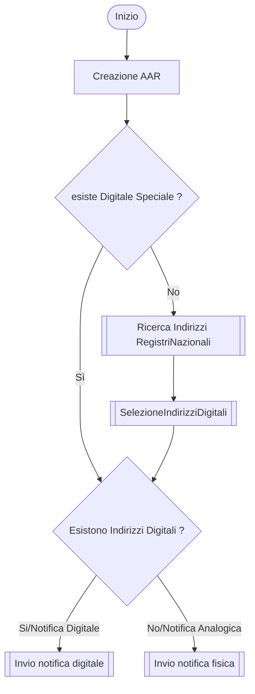
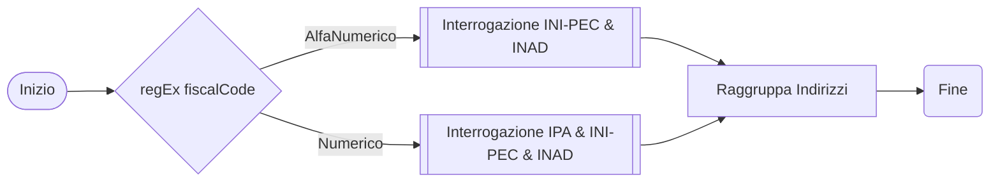
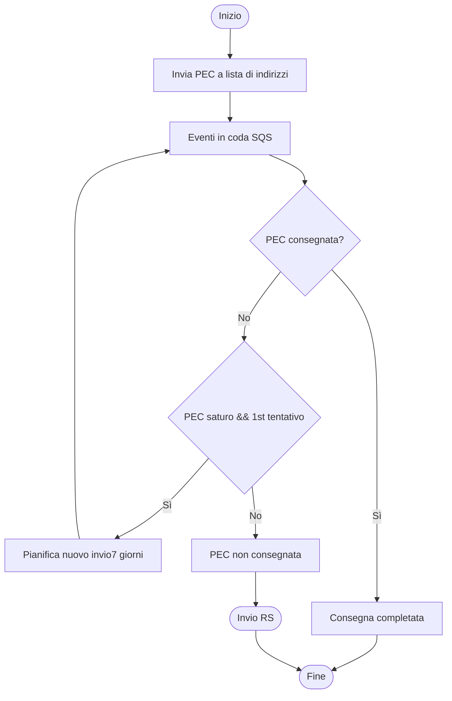
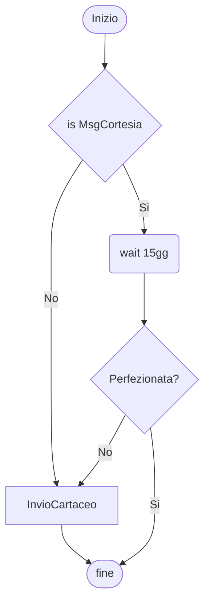
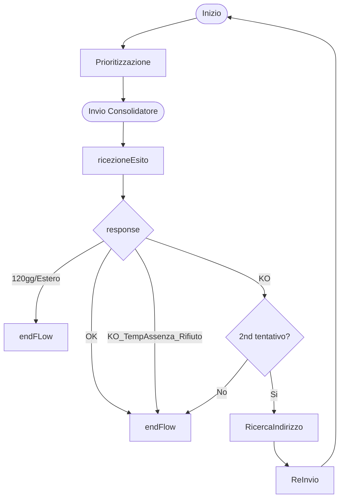

L'attuale percorso della notifica è illustrato in 

## Workflow per ogni singolo destinatario, scelta flusso di notificazione

Questo workflow è attivato per ogni destinatario della notifica , avendo l'obiettivo di selezionare quale tipo di processo di notifica utilizzare : 
- Processo Analogico, ovvero con la spedizione della missiva cartacea presso l'indirizzo fisico
- Processo Digitale, ovvero utilizzando uno o più degli indirizzi digitali associati al destinatario. 

### Ricerca Indirizzi Registri Nazionali
Dato un codice fiscale del destinatario, il processo ha il compito di identificare tutti i suoi possibili indirizzi digitali.

In base alla composizione del codice fiscale vengono interrogati gli archivi 
- alfanumerico : INI-PEC, INAD 
- numerico : 

### Selezione Indirizzi Digitali
In base alle interrogazioni sui registri nazionali e le informazioni riportate all'interno della piattaforma vengono selezionati gli indirizzi digitali da utilizza ( 1+) per la notifica.

## Invio Notifica Digitale 
Il processo di notifica digitale,a differenza di quanto attualmente presente in piattaforma invia l'AAR ad un insieme di indirizzi digitali. 
Il processo si conclude quando almeno un indirizzo digitale viene consegnato.

Abbiamo diverse possibili soluzioni : 

Opzione1 : Notifichiamo tutti gli eventi di recapito per tutti i possibili indirizzi , sarà possibile avere quindi in timeline sia eventi di mancato recapito che di recapito avvenuto (?)

Opzione2 : attendiamo la risposta a tutti gli invii email, quindi potremo registrare la notifica dopo 24 anche se la la prima mail ha risposto subito. 

Opzione3: Notifichiamo la prima risposta positiva o al più dopo 24 ore o 7gg nel caso di retry. Potremo quindi mettere in notifica e poi consegnare la seconda mail dopo 7gg. 

## Invio Notifica Digitale (Flowchart)

## Invio Notifica Analogica

## InvioCartaceo

L'invio analogico viene eseguito per mezzo di un "consolidatore" il quale prende in carico le notifiche e le smista tra i diversi recapitisti aderenti alla piattaforma.
L'invio cartaceo verso il consolidatore avviene massivamente in 2/3 momenti della giornata lavorativa ( Lun-Ven)

- Bisogna verificare il deceduto ! 

