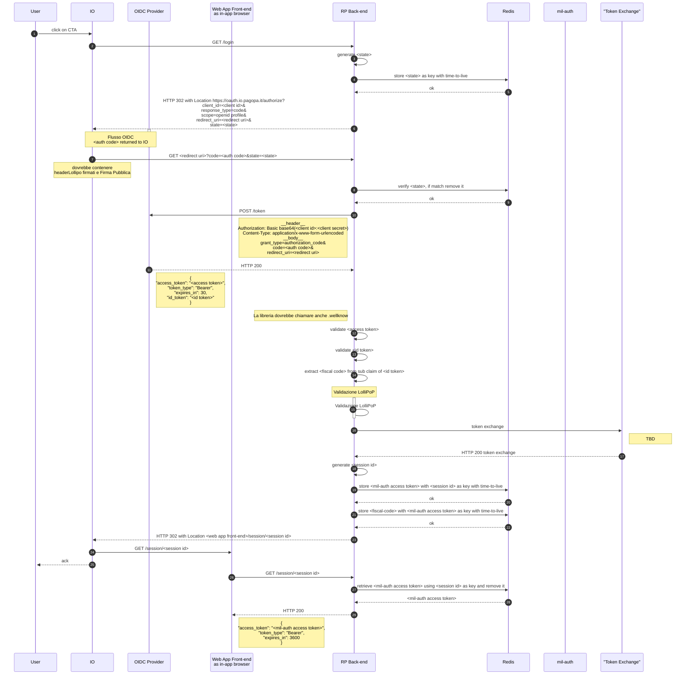

# Flusso SSO/FIMS

Il Servizio SEND che eseguirà il Relying Party è lo stesso servizio che sta inviando i messaggi ? oppure è un servizio dedicato alla delega ? 

```mermaid
sequenceDiagram
    autonumber
    participant User
    participant IO
    participant OIDC_Provider as OIDC Provider
    participant Web_App_Front_end as Web App Front-end<br>as in-app browser
    participant RP_Back_end as RP Back-end
    participant Redis
    participant mil-auth
    participant token_chg as "Token Exchange"

    activate User
    User->>IO: click on CTA
    IO->>RP_Back_end: GET /login
    RP_Back_end->>RP_Back_end: generate <state>
    RP_Back_end->>Redis: store <state> as key with time-to-live
    Redis-->>RP_Back_end: ok
    RP_Back_end-->>IO: HTTP 302 with Location https://oauth.io.pagopa.it/authorize?<br>client_id=<client id>&<br>response_type=code&<br>scope=openid profile&<br>redirect_uri=<redirect uri>&<br>state=<state>

    activate OIDC_Provider
    Note over IO,OIDC_Provider: Flusso OIDC <br> <auth code> returned to IO
    deactivate OIDC_Provider

    IO->>RP_Back_end: GET <redirect uri>?code=<auth code>&state=<state>
    Note over IO : dovrebbe contenere <br> headerLollipo firmati e Firma Pubblica 

    RP_Back_end->>Redis: verify <state>, if match remove it
    Redis-->>RP_Back_end: ok
    RP_Back_end->>OIDC_Provider: POST /token
    Note left of RP_Back_end: __header__<br>Authorization: Basic base64(<client id>:<client secret>)<br>Content-Type: application/x-www-form-urlencoded<br>__body__<br>grant_type=authorization_code&<br>code=<auth code>&<br>redirect_uri=<redirect uri>
    OIDC_Provider-->>RP_Back_end: HTTP 200
    Note right of OIDC_Provider: {<br>"access_token": "<access token>",<br>"token_type": "Bearer",<br>"expires_in": 30,<br>"id_token": "<id token>"<br>}
    Note left of RP_Back_end: La libreria dovrebbe chiamare anche .wellknow

    
    RP_Back_end->>RP_Back_end: validate <access token>
    RP_Back_end->>RP_Back_end: validate <id token>
    RP_Back_end->>RP_Back_end: extract <fiscal code> from sub claim of <id token>

    Note over RP_Back_end : Validazione LolliPoP 
    activate RP_Back_end 
    RP_Back_end -> RP_Back_end : Validazione LolliPoP
    deactivate RP_Back_end
    
    RP_Back_end->>token_chg : token exchange
    note right of token_chg: TBD
    token_chg -->> RP_Back_end : HTTP 200 token exchange


    %%    RP_Back_end->>mil-auth: POST /token
    %%    Note left of RP_Back_end: __header__<br>Content-Type: application/%%x-www-form-urlencoded<br>__body__<br>grant_type=client_credentials&%%<br>client_id=<mil-auth client id>&<br>client_secret=<mil-auth client secret>
    %%    mil-auth-->>RP_Back_end: HTTP 200
    %%    Note right of mil-auth: {<br>"access_token": "<mil-auth access token>",%%<br>"token_type": "Bearer",<br>"expires_in": 3600<br>}
    
    RP_Back_end->>RP_Back_end: generate <session id>
    RP_Back_end->>Redis: store <mil-auth access token> with <session id> as key with time-to-live
    Redis-->>RP_Back_end: ok
    RP_Back_end->>Redis: store <fiscal-code> with <mil-auth access token> as key with time-to-live
    Redis-->>RP_Back_end: ok
    RP_Back_end-->>IO: HTTP 302 with Location <web app front-end>/session/<session id>
 

    IO->>Web_App_Front_end: GET /session/<session id>
    IO-->>User: ack
    Web_App_Front_end->>RP_Back_end: GET /session/<session id>
    RP_Back_end->>Redis: retrieve <mil-auth access token> using <session id> as key and remove it
    Redis-->>RP_Back_end: <mil-auth access token>
    RP_Back_end-->>Web_App_Front_end: HTTP 200
    Note right of Web_App_Front_end: {<br>"access_token": "<mil-auth access token>",<br>"token_type": "Bearer",<br>"expires_in": 3600<br>}
```