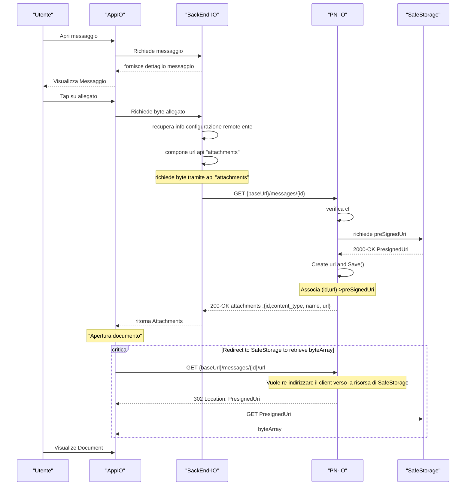

```mermaid
sequenceDiagram
    participant user as "Utente"
    participant app as "AppIO"
    participant io as "BackEnd-IO"
    participant pn-io as "PN-IO"
    participant ss as "SafeStorage"
   
    user ->> app : Apri messaggio
    app ->> io : Richiede messaggio 
    io -->> app : fornisce dettaglio messaggio
    app -->> user : Visualizza Messaggio 

    user ->> app : Tap su allegato
    app ->> io : Richiede byte allegato  
    io ->> io : recupera info configurazione remote ente
    io ->> io : compone url api "attachments" 
    note over io : richiede byte tramite api "attachments" 
    io ->> pn-io : GET {baseUrl}/messages/{id} 
    pn-io ->> pn-io : verifica cf 
    pn-io ->> ss: richiede preSignedUri
    ss -->> pn-io: 2000-OK PresignedUri
    pn-io ->> pn-io: Create url and Save()
    note over pn-io: Associa (id,url)->preSignedUri 
    pn-io -->> io : 200-OK attachments :{id,content_type, name, url}
    io -->> app : ritorna Attachments
    note over app: "Apertura documento"  
    critical Redirect to SafeStorage to retrieve byteArray  
    app ->> pn-io : GET {baseUrl}/messages/{id}/url
    note over pn-io : Vuole re-indirizzare il client verso la risorsa di SafeStorage 
    pn-io -->> app : 302 Location: PresignedUri
    app ->> ss: GET PresignedUri
    ss -->> app : byteArray
    end
    user ->> app : Visualize Document     
```