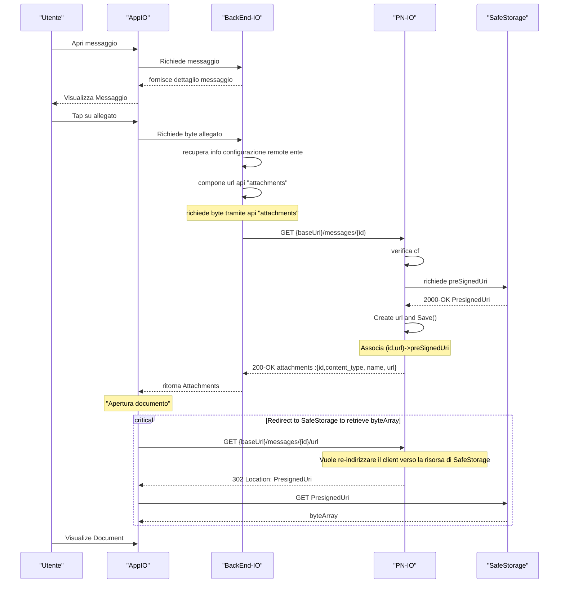

# Allegati di un messaggio dell'aggregatore Orchestratore

## Pillars
- L'integrazione verso IO è gestita dal microservizio *pn-io*
- Tutti i documenti sono gestiti/conservati dal sotto-sistema SafeStorage i cui client sono tutti microservii interni, ma è in grado di esporre endpoint pubblici pre-autorizzati per tempi limitati ( PresignedURI, tempo configurabile )
- Per poter accedere far accedere ad un documento, *pn-io* deve creare una presignedUri attraverso la quale un qualsiasi attore ( in questo caso App IO ) può accedere per un tempo limitato al documento 

## Descrizione del flusso

Il diagramma rappresenta un accesso in due tempi all'allegato. Nella prima fase l'utente apre il messaggio e App IO recupera dal BackEnd IO il dettaglio del contenuto. In questo passaggio il documento non viene ancora scaricato: l'app ottiene solo le informazioni necessarie a mostrare il messaggio e a capire che esiste un allegato disponibile.

Quando l'utente seleziona l'allegato, inizia la seconda fase. BackEnd IO usa l'API `attachments` esposta da `pn-io` per ottenere i metadati dell'allegato e un URL logico associato alla risorsa. `pn-io` non espone direttamente il file conservato, ma verifica prima il codice fiscale del destinatario e poi chiede a SafeStorage una `PresignedUri` temporanea. Questa URI viene salvata e associata a un identificativo applicativo, così il backend può restituire ad App IO un riferimento stabile lato dominio senza esporre subito l'URL firmato.

L'effettivo download del documento avviene solo nel passo finale. App IO richiama l'endpoint di redirect su `pn-io`, che risponde con `302 Location` verso la `PresignedUri` ottenuta da SafeStorage. A quel punto il client scarica i byte direttamente da SafeStorage, senza far transitare il contenuto del file attraverso `pn-io` o BackEnd IO. In questo modo si separano chiaramente controllo degli accessi e consegna del contenuto: `pn-io` autorizza e orchestra, mentre SafeStorage rimane il punto di esposizione temporanea del documento.

In sintesi, il flusso ha tre obiettivi principali:

1. mantenere i documenti nel perimetro di SafeStorage;
2. demandare a `pn-io` la verifica del destinatario e la generazione dell'accesso temporaneo;
3. consentire ad App IO di scaricare l'allegato con un redirect, riducendo accoppiamento e responsabilità dei servizi intermedi.