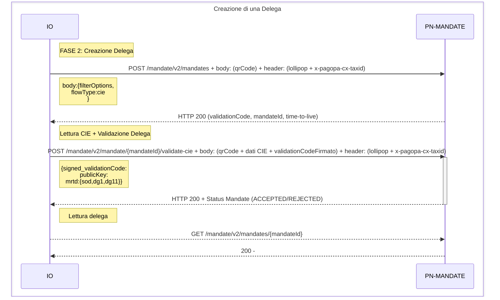

# Creazione di una delega

Le deleghe di SEND rientrano nel dominio del microservizio pn-mandate. 

La creazione di una delega su SEND avviene sempre in due passaggi : 
- Creazione della delega 
- Validazione della richiesta

Nella prima fase ( Creazione della Delega ) viene definita la delega (`mandateId`); La delega  non è ancora attiva e risulta essere in uno stato di attesa ( `status:PENDING`) per essere validata. Una delega non può mai essere modificata e deve essere validata entro un tempo definito (`time-to-live`)

Nella seconda fase (Validazione della delega) la delega viene validata. Le modalità di validazione dipendono dal flusso eseguito, vedi più avanti. 

## Flusso di creazione delega
Una delega può essere creata attraverso uno dei seguenti flussi (`flowType`) : 

- standard
- b2b
- cie

### Flusso standard 
In questo flusso rappresenta la creazione di una delega attraverso il portale SEND. La creazione della delega avviene da parte del delegante il quale dovrà comunicare il validationCode al delegato che, tramite il portale SEND, potrà validare la delega.

Le deleghe in questo flusso hanno valori standard di durata 6 mesi.

### Flusso b2b
Questo flusso parte dal delegato e viene confermato dal delegato stesso interagendo con il delegante per altri mezzi al di fuori della piattaforma. 

Le deleghe di questo flusso hanno una duranta standard di 1 anno

### Flusso cie 
Questo flusso parte dal delegato e viene confermato dal delegato stesso senza interazione con il delegante, ma ottenendo i dati di lettura della sua CIE.

Le deleghe di questo flusso hanno una duranta default di 15 minuti e non possono essere richieste durante superiori a 30 Minuti. Devono inoltre essere necessariamente filtrate per IUN

