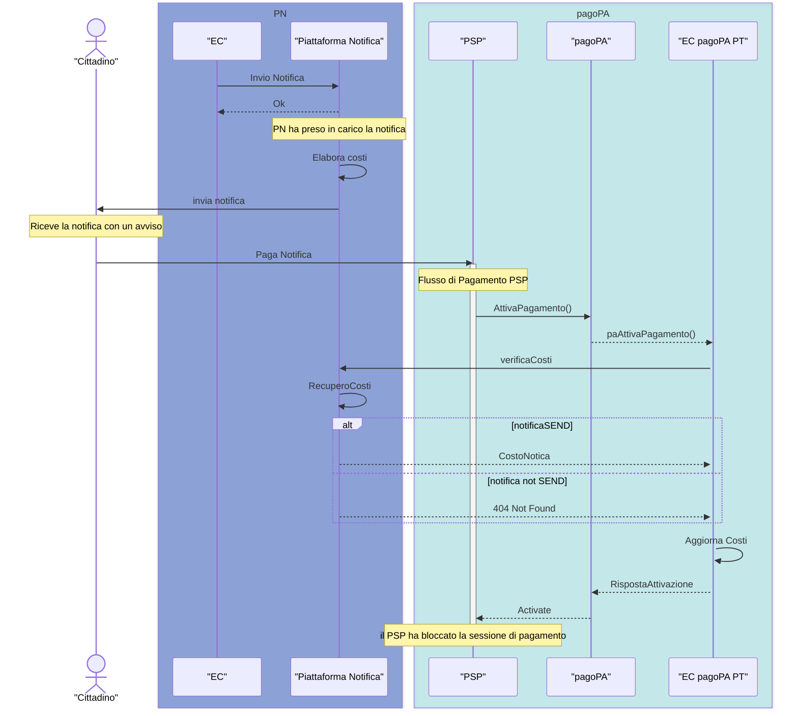

# Proposal 1

## Stelle Polari 

- SEND non è responsabile del prezzo dell'avviso; SEND è responsabile di comunicare , a colui che deve gestire il pagamento, i costi di notifica. Se applicare o meno i costi di notifica è una scelta dell'Ente ed esula dalla piattaforma notifiche. 
- SEND è una piattaforma autonoma dalle altre piattaforme di PagoPA.

Diagramma ad alto livello : 
- L'ente invia una notifica attraverso PN 
- PN elabora la modalità di comunicazione ( ed i costi associati )
- PN invia la notifica al cittadino ( digitale/cartacea )
- il Cittadino effettua il pagamento 

Il flusso dell'aggiornamento dei costi di notifica
