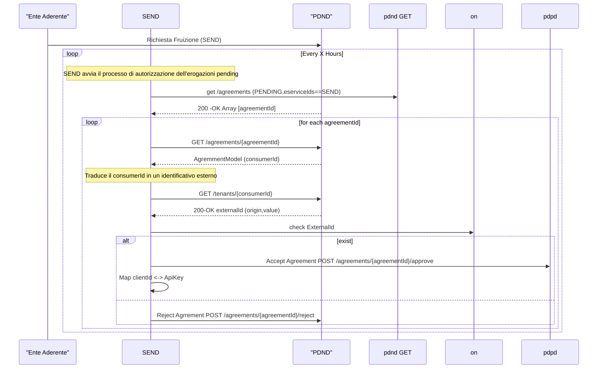
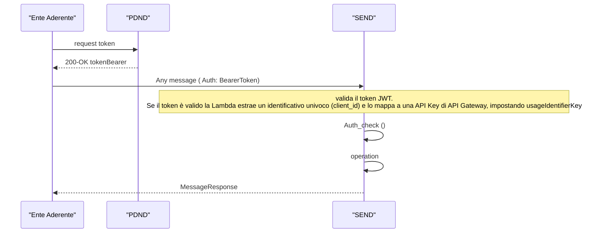

# Flusso di autenticazione Servizio PDND

Al fine di poter fruire del servizio SEND tramite PDND , l'Ente (aka fruitore) dovrà : 

1. Sottoscrivere contratto SEND
2. Richiedere richiesta di fruitore sul catalogo PDND ( potrebbe fare piu richieste, uno per ogni Partner Tecnologico)
3. Accettata la richiesta potrà procedere con l'utilizzo del servizio 

## Sottoscrizione del contratto

Il processo di sottoscrizione avviene su piattaforma Area Riservata. Il processo è già in essere, al termine del processo tutte le PA che hanno sottoscritto un contratto sono disponibili presso .. 
<TBD>

Alla sottoscrizione del contratto arriva sulla coda onboarding il seguente dato 

{
    "id": "string: Identificativo",
    "address": "string: Indirizzo "
    "created" : "string: data di creazione dell'elemento"
    "description": "string: Nome dell'ente"
    "digitalAddress": "string: indirizzo email",
    "externalId":"string: identificativo su area SelfCare",
    "ipdaCode": "string: codice IPA" ,
    "lastUpdate": "string",
    "onlyRootState"
    "rootId"
    "sdiCode"
    "status"
    "taxCode"
}

## Richiesta di fruizione

Ogni richiesta di fruizione indica la creazione di un nuovo client su PDND da parte dell'ente. 
Ad ogni client viene quindi : 
- garantito accesso
- isolato rispetto agli altri client dello stesso ente ( gruppo )

Dalla chiamata /tenants/{consumerId} viene recuperate le informazioni di identificazione dell'ente. Esistono i seguenti casi 

- PA inserite all'interno del registro IPA
- Altro 

externalId": {
"origin": "AAA",
"value": "string"
},

Nel caso di PA , origin == IPA e value contiene il codice IPA
che viene ricercato all'interno di onboardingInstitution e se esiste un contratto sottoscritto, viene aggiunto un elemento all'interno 
della tabella 

- Viene creato un nuovo gruppo 
- viene creato un nuovo virtualKey associato al gruppo ed al taxCode dell'ente

APIKEY, inserendo il clientId ( come se fosse il virtualKey )

| campo  |Type   | Descrizione  |Mapping   |   |
|---|---|---|---|---|
| id  |Stringa   | N/A  |   |   |
| correlationId  | S  |   |   |   |
| groups  | L  | Array di gruppi associati  |   |   |

{
  "id": {
    "S": "a089932d-d8bb-4f00-892c-18248491c6e9"
  },
  "correlationId": {
    "S": "9506d826-b9e9-4618-b96e-d2eb1220506e"
  },
  "groups": {
    "L": []
  },
  "lastUpdate": {
    "S": "2024-09-23T15:13:40.556000001"
  },
  "name": {
    "S": "CUCUMBER GROUP TEST"
  },
  "pdnd": {
    "BOOL": false
  },
  "scope": {
    "S": "APIKEY"
  },
  "status": {
    "S": "ENABLED"
  },
  "statusHistory": {
    "L": [
      {
        "M": {
          "changeByDenomination": {
            "S": "e9e4a9c7-9586-4b92-a7dd-ee1a0e77d398"
          },
          "date": {
            "S": "2024-02-28T06:33:07.599838426"
          },
          "status": {
            "S": "CREATED"
          }
        }
      }
    ]
  },
  "virtualKey": {
    "S": "763ab40d-1e7f-43ab-9759-c305567344e5"
  },
  "x-pagopa-pn-cx-id": {
    "S": "5b994d4a-0fa8-47ac-9c7b-354f1d44a1ce"
  },
  "x-pagopa-pn-cx-type": {
    "S": "PA"
  },
  "x-pagopa-pn-uid": {
    "S": "e9e4a9c7-9586-4b92-a7dd-ee1a0e77d398"
  }
}

## Utilizzo del Servizio 

Quando l'Ente Aderente, dopo aver ottenuto la richiesta di fruizione, potrà

1. Staccare un token pdnd
2. Richiamare il servizio utilizzando token pdnd

Il token ricevuto, viene aperto e viene recuperato il clientId ed agreementId 
Il clientId viene quindi ricercato all'interno del database ed associato 
- senderTaxCode
- groupId
- viene assegnato un rateLimit 

Il servizio su PDND può abilitare tracking richiedendo l'identità del soggetto che sta effettuando la chiamata, differenziando 

[AUDIT_REST_01] Inoltro dati tracciati nel dominio del Fruitore REST