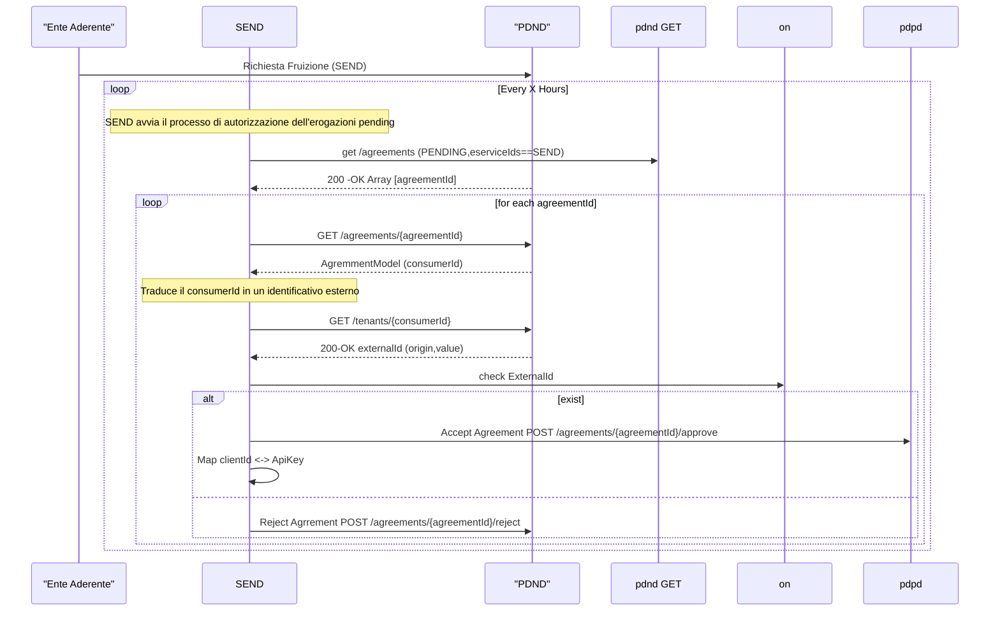
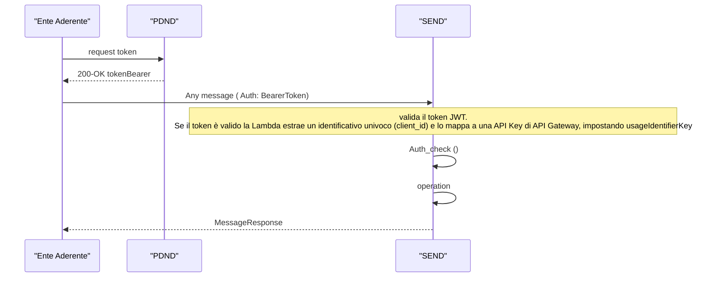

# Flusso di autenticazione Servizio PDND

Al fine di poter fruire del servizio SEND tramite PDND , l'Ente (aka fruitore) dovrà : 

1. Sottoscrivere contratto SEND
2. Richiedere richiesta di fruitore sul catalogo PDND
3. Accettata la richiesta potrà procedere con l'utilizzo del servizio 

## Sottoscrizione del contratto

Il processo di sottoscrizione avviene su piattaforma Area Riservata. Il processo è già in essere, al termine del processo tutte le PA che hanno sottoscritto un contratto sono disponibili presso .. 
<TBD>

## Richiesta di fruizione

## Utilizzo del Servizio 

Quando l'Ente Aderente, dopo aver ottenuto la richiesta di fruizione, potrà

1. Staccare un token pdnd
2. Richiamare il servizio utilizzando token pdnd

