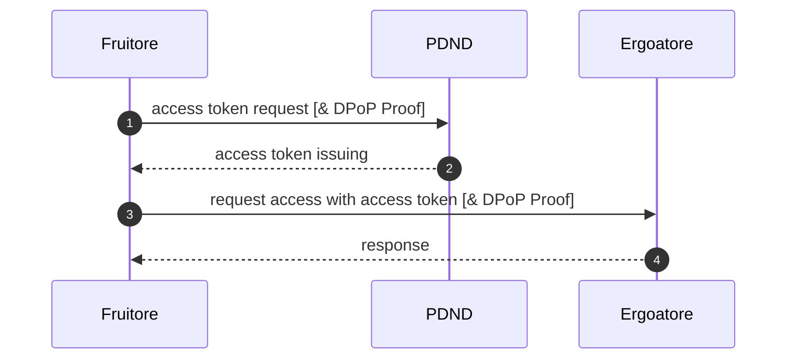

# flow PDND

la PDND realizza il compito di A&A Server per abilitare l'accesso agli e-service (leggi API) rese disponibili dagli Aderenti

per l'emissione di un access token:
- l'Autenticazione dei richiedenti l'accesso ad un e-service, nel nomenclatore PDND questo soggetto è detto Fruitore, è realizzata attraverso la verifica della firma della client assertion presentata a PDND in merito si consideri:

  - i Fruitore definiscono i loro keychain dove depositano le chiavi puppliche dagli stessi utilizzati 
  - applichiamo https://www.rfc-editor.org/rfc/rfc7521 

- l'Autorizzazione di un Fruitore ad uno specifico e-service è determinata da:

  1. il purposeId (leggi finalità/analisi del rischio nel nomenclatore PDND) indicato nella client assertion è attivo
  2. l'agreement (leggi richiesta di fruizione nel nomenclatore PDND) a cui è collegato il purposeId è attivo
  3. il cliendId indicato nella client assertion è collegato al purposeId
   
  da ricordare che il ciclo di vita degli agreement e dei purpose sono gestiti dagli operatori degli aderenti sulla UX di PDND o tramite le API rese disponibile da PDND agli aderenti

# step per l'accesso ad un e-service

si assume che gli Aderenti abbiano provveduto a:

- Erogatore: pubblicare un e-service
- Fruitore: richiedere la fruzione (agreement) dell'e-service
- [OPT] Erogatore: confermare la richiesta di fruzione (agreement)
- Fruitore: definire la finalità (purpose) e compilare l'analisi del rischio
- Fruitore: associare il keychain alla finalità (purpose)

PDND e gli Aderenti attuano il flow previsto:
- per Bearer Token in https://www.rfc-editor.org/rfc/rfc6750
- per DPoP Token:ì in https://www.rfc-editor.org/rfc/rfc9449

1. L'Erogatore effettua acccess token request per una specifica finalità relative ad un e-service [nel caso di DPoP Token presente anche una DPoP Proof] 
2. La PDND effettua autenticazione ed autorizzazione ed emette access token
3. L'erogatore effettua l'accesso all'e-service presentato l'access token emesso da PDND [nel caso di DPoP Token presente anche una DPoP Proof] 
4. Il fruitore verifica l'access token (correttezza e firma da parte di PDND) [nel caso di DPoP Token verifica la DPoP Proof presentata] e abilità l'accesso

