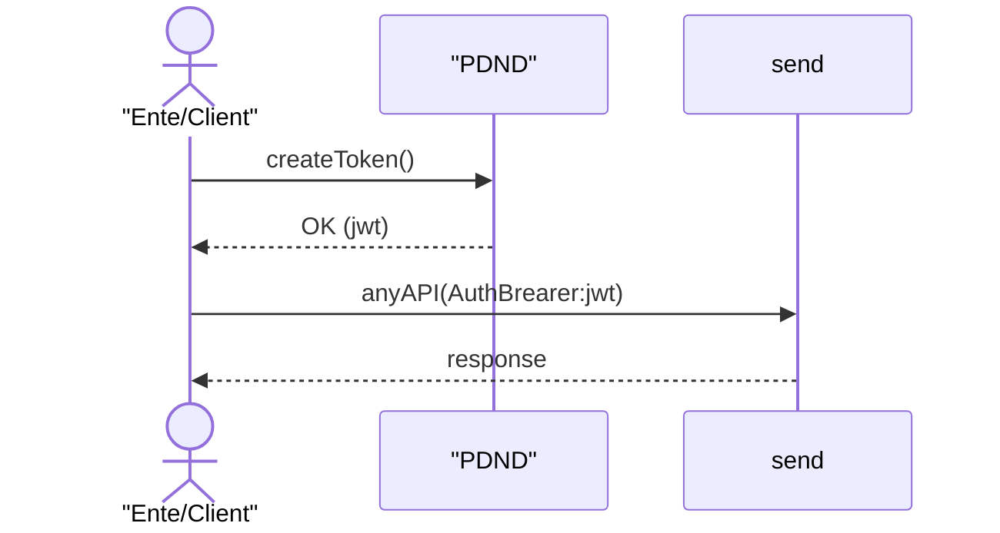
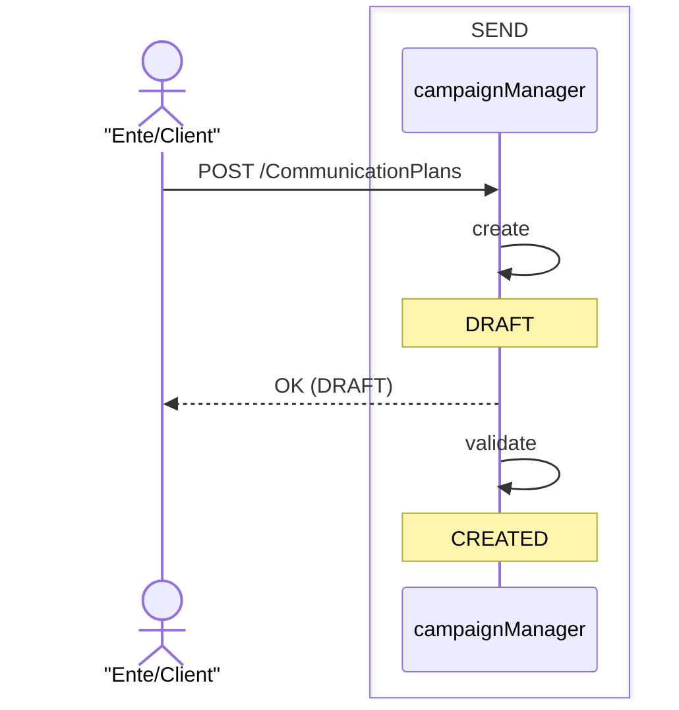
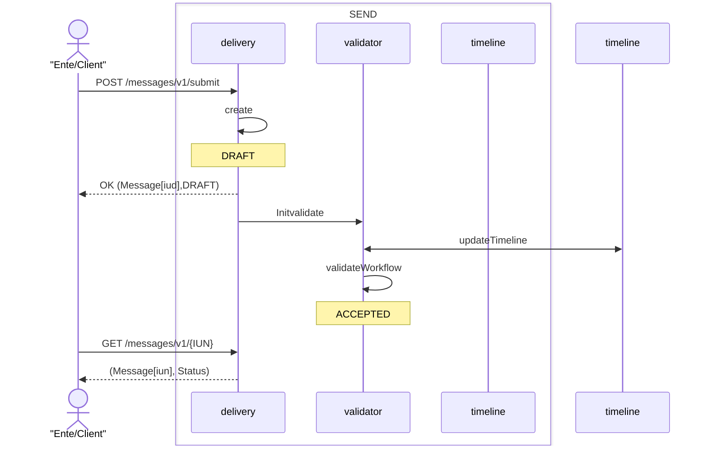

# Comunicazioni Bonarie

Per poter inviare una comunucazione bonaria, l'ente dovrà seguire i seguenti passi 

1. Adesione al serivizio (TBD)
2. Fruizione del servizio 
2. Creazione di una campagna (/servizio)
3. Invio del messaggio 

## Adesione al servizio (TBD)
... da specificare ...

> Al termine di tale fase : 
> - l'orchestratore ha ottenuto la delega su IO, possiede una api-key _managed_ 
>
> - l'orchestrstore ha ottenuto la delega su PDND, e' in grado di generare un token PDND a nome dell'ente 
> - l'ente ha creato un e-client PDND con i permessi di fruitore al servizio Orchestratore
> - sono attivi i processi di fatturazione del servizio 

## Fruizione del servizio
Il servizio di comunicazioni bonarie è erogato all'interno del catalogo dei servizi PDND. Per poter utilizzare il servizio sarà necessario creare un client e-service ed effettuare la richiesta di erogazione. 

> Al termine di tale processo, l'ente possiede un client e-service con il quale è in grado di acquisire un token autorizzativo JWT per utilizzare le API esposte dal prodotto. 

## Creazione del servizio
Il primo passo per poter inviare un messaggio è la creazione di una "campagna di comunicazione", durante questa fase l'ente specifica (almeno): 
- quali canali vuole utilizzare 
- l'eventuale servizio di IO da utilizzare ( oppure i dettagli per crearne uno nuovo )
- tassonomia 

> La campagna individua il caso d'uso dell'Ente e contiene le informazioni di carattere comune/generale delle notifiche. Non contiene dati degli individui. La immagino a due step per effettuare verifiche prima di abilitarli all'invio dei messaggi. 
 
### I Servizi su IO 
Per poter creare /gestire servizi di un Ente, quest'ultimo deve eleggere l'orchestratore come Ente Aggregatore. Eseguito tale processo ( da definire in sede di adesione al contratto, vedi sopra ) otterremo una chiave di tipo _manage_ associata all'ente  ( una per ogni ente ) attraverso la quale possiamo creare/gestire un servizio dell'ente. 

Nel caso di creazione del servizio, i servizi hanno il seguente workflow 
- DRAFT
- SOTTOMESSO In Pubblicazione ( da verificare il nome )
- PUBLISHED
- DISMISSED

Il cambio tra sottomissione e PUBLISHED, avviene attraverso approvazione da parte di un operatore ( L1/L2 tramite CRM ). 

Nel caso di utilizzo di un servizio già in essere, l'orchestratore utilizzando la chiave _managed_ dell'ente per poter recuperare l'api-key associata al servizio ed inviare messaggi 

> Per poter inviare un messaggio su IO è necessario avere l'api-key del servizio.

## Invio del Messaggio 
L'ente invia il messaggio ai destinatari 

> Dovremo capire come meglio identificare il messaggio a quale campagna appartiene, abbiamo diverse strade 
>  - *path parameters* : questa opzione è semplice, ma stiamo legando in maniera forte due microservizi 
>  - *authentication*: potremmo generare delle chiavi (stile x-apy-key o altra soluzione  ) alla creazione della campagna. Questo genera due livelli di autenticazione ( admin e delle campagna ).
> - *all'interno del body* 
> - all'interno dell'_Header_ (come mostrato nel descrittore proposto)

Dopo la creazione del _CommunicationPlan_ , l'ente può iniziare ad inviare i singoli messaggi; Ad ogni messaggio ricevuto viene assegnato un identificato univoco (iun) e preso in carico dalla piattaforma (DRAFT). Successivamente viene valutato ed accettato ( o rifiutato ) 

>Al termine di questo processo la comunicazione è presa in carico. Dobbiamo evidenziare gli step di validazione

## Processamento del Messaggio

Una notifica accettata, inizia l'iter di comunicazione.
In alcuni scenari l'azione richiesta al cittadino potrebbe arrivare sui sistemi dell'ente, per poter bloccare l'iter Durante il processamente del messaggio, l'ente 
Al termine dell'accettazione di un messaggio, viene generato un evento di nuovo_messaggio_accettato che viene distribuito ai seguenti servizi : 

- **pn-io-messages** : per l'invio su IO 
- **pn-ec** : per l'invio via mail 
- **pn-paper-channel**  : per l'invio cartaceo 

i servizi procedono in maniera autonoma ad inviare la comunicazione, invieranno tre eventi : 
- _messaggio-inviato_ : il messaggio è stato spedito
- _messaggio-consegnato_ : il messaggio ha raggiunto la destinazione 
- _messaggio-letto_ : il messaggio è stato letto dal cittadino 

Tutti i servizi leggono anche questi eventi ed in caso di messaggio-letto interrompono il loro processamento ( se possibile )
- _messaggio-annullato_ : un messaggio precedentemente gestito è stato interrotto, non verrà quindi inviato.

### Workflow - Spedizione Analogica
Il Workflow è composto di Step consecutivi , fino ad arrivare al caso estremo di invio del messaggio tramite prodotto postale. 
Con l'inserimento della "gestione picchi", non possiamo permettere di far concidere la pianificazione della posta con lo step del workflow, è necessario che i preparativi della spedizione siano fatti in maniera preventiva per poi verificare nel giorno della pianificazione se inserire o meno la spedizione. 

Bisogna inoltre prevedere di annullare una pianificazione , ma solo se il messaggio non è stato affidato al consolidatore.

## Interrogazione della campagna
Durante l'esecuzione della campagna l'Ente vorrà valutare il processamento dei messaggi

- Verificare lo stato puntuale di una  notifica
- Verificare andamento complessivo di una campagna 