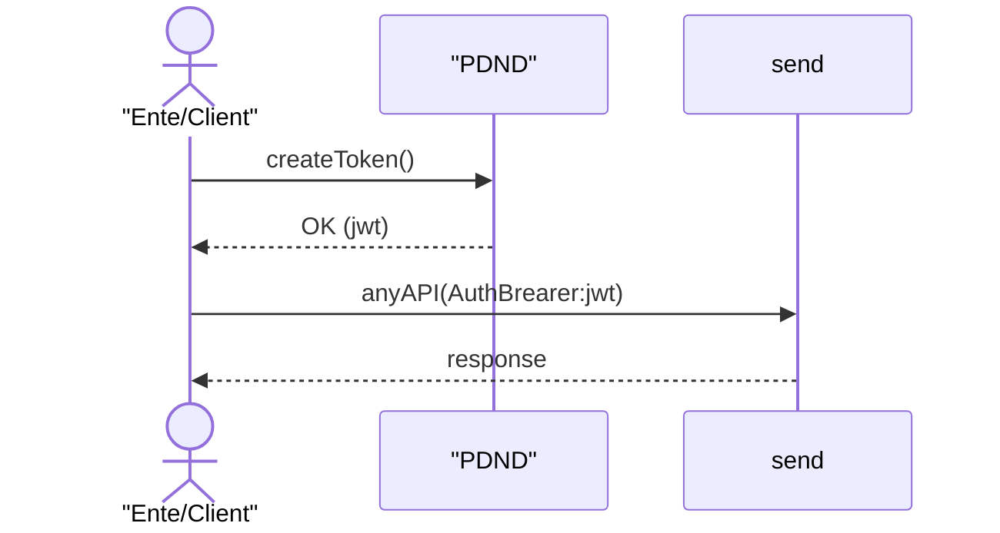
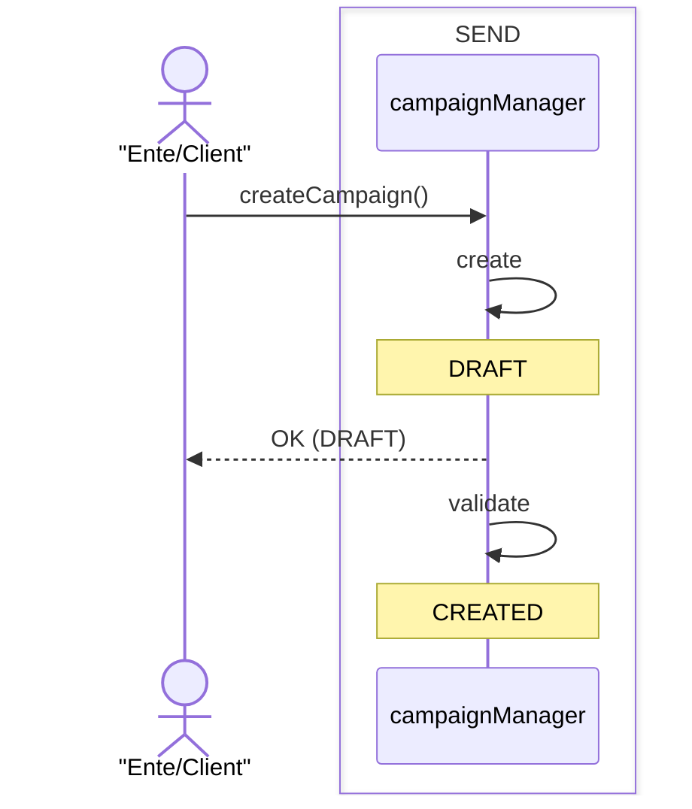
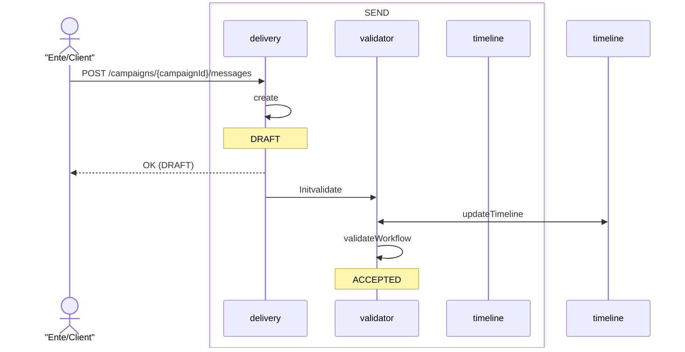

# Comunicazioni Bonarie

Per poter inviare una comunucazione bonaria, l'ente dovrà seguire i seguenti passi 

1. Adesione al serivizio (TBD)
2. Fruizione del servizio 
2. Creazione di una campagna (/servizio)
3. Invio del messaggio 

## Adesione al servizio (TBD)
... da specificare ...

> Al termine di tale fase l'ente è abilitato ad utilizzare l funzionalità e sono state definire le regole per la fatturazione del servizio. 

## Fruizione del servizio
Il servizio di comunicazioni bonarie è erogato all'interno del catalogo dei servizi PDND. Per poter utilizzare il servizio sarà necessario creare un client e-service ed effettuare la richiesta di erogazione. 

> Al termine di tale processo, l'ente possiede un client e-service con il quale è in grado di acquisire un token autorizzativo JWT per utilizzare le API esposte dal prodotto. 

## Creazione del servizio
Il primo passo per poter inviare un messaggio è la creazione di una "campagna di comunicazione", durante questa fase l'ente specifica (almeno): 
- quali canali vuole utilizzare 
- l'eventuale servizio di IO da utilizzare ( oppure i dettagli per crearne uno nuovo )
- tassonomia 

> La campagna individua il caso d'uso dell'Ente e contiene le informazioni di carattere comune/generale delle notifiche. Non contiene dati degli individui. La immagino a due step per effettuare verifiche prima di abilitarli all'invio dei messaggi. 

## Invio del Messaggio 
L'ente invia il messaggio ai destinatari 

>Al termine di questo processo la comunicazione è presa in carico. Dobbiamo evidenziare gli step di validazione

## Processing del Messaggio
Una notifica accettata, inizia l'iter di comunicazione. 