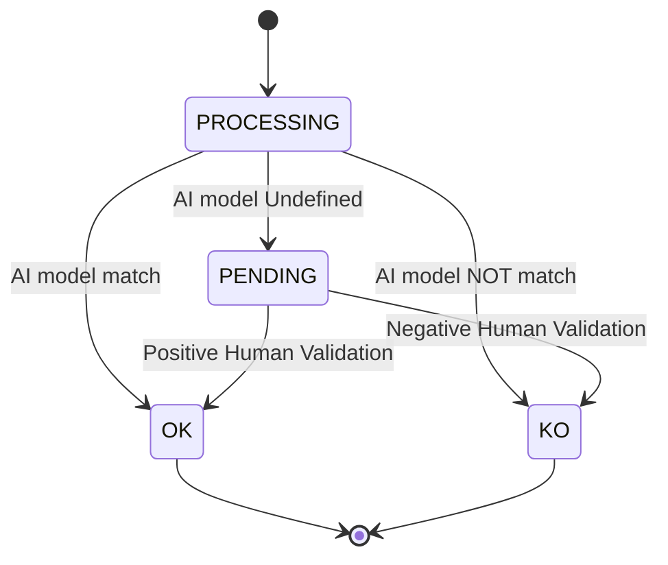

# Integrazione Servizio OCR 

Il Servizio OCR/AI offerto da dataLake verrà integrato all'interno della piattaforma SEND nell'attuale processo di postalizzazione con un pattern di comunicazione asincrona basato su eventi. 

Il Servizio ha il compito di verificare ( OK/KO ) se i metadati di un documento di postalizzazione presenti in piattaforma corrispondono ai dati presenti sulla dematerializzazione del documento. 

Esiste tuttavia un'ulteriore casistica (PENDING ) in cui l'esito dell'opearazione del modello AI è incerto ed è necessario un ulteriore intevento da parte di un operatore per concludere l'opearazione di verifica. 

Pertanto la macchina a stati del processamento di una singola richiesta è la seguente 



Il diagramma  seguente mostra un flusso di elaborazione di messaggi tra diversi componenti del sistema, utilizzando code di messaggi (SQS) per la comunicazione asincrona.

Le box rappresentano le region AWS , una dedicata a PN ed una dedicata a dataLake

I componenti coinvolti sono :
 - [SEND] _pn_event_enricher_ : rappresenta il micro-servizio incaricato di gestire la comunicazione con il servizio OCR. Da consolidare 
 - [SEND] _AWS S3_ è lo storage di SEND dove sono presenti i documenti
- [DataLake] Servizio OCR 

Ecco una breve descrizione dei componenti e del flusso:

- _pn-event-enriche_ invia un messaggio di richiesta a DataLake-SQS.
- OCR Service consuma il messaggio da DataLake-SQS e lo elabora.
- In caso di errore semantico, OCR Service invia un messaggio di risposta di errore a PN SQS.
- Se il messaggio ha passato la validazione semantica , OCR Service recupera gli allegati da PN SafeStorage e processa la richiesta.
- A seconda del risultato dell'elaborazione, OCR Service invia un messaggio di risposta (successo, errore o pending) a PN SQS.
pn-event-enricher consuma il messaggio di risposta da PN SQS.

> [!NOTE]
> Requisiti non funzional
>- Ci si aspetta che l'elaborazione del modello AI venga >eseguita entro le 12H dalla richiesta. 
>- E' chiaro che, in un primo periodo , non essendo ancora >noto l'indice di affidabilità e non essendo ancora >disponibile l'intervento degli operatori , il servizio OCR >restituirà esclusicamente PENDING e OK. Tutti i KO del >modello saranno comunque passati all'analisi manuale per >verificare eventuali errori. 
>- Numero di richieste 100K/giorno (da confermare) 


```mermaid
sequenceDiagram
    autonumber

    box rgba(21, 239, 181, 0.26) "PN" 
    participant pn as "pn-event-enricher"
    participant pn_sqs as "PN SQS"
    participant stg as "SEND AWS S3"
    end 

    box DataLake
    participant dl_sqs as "DataLake-SQS"
    participant dl_ocr as "OCR Service"
    end 

    pn ->> dl_sqs : /produce[request_event_message]
    dl_sqs -->> pn : OK

    dl_ocr ->> dl_sqs : /consume message
    dl_sqs -->> dl_ocr : request_event_message

    dl_ocr ->> dl_ocr : Decode RequestMessage
    alt Semantic Error
        dl_ocr ->> pn_sqs : produce[dl_ocr_response_message(error)]
        note right of pn_sqs : Semantic Error\n message is not processable
    else request message is valid
        dl_ocr ->> dl_ocr : Retrieve Attachments
        dl_ocr ->> stg : /download pre-signedUrl
        stg -->> dl_ocr : 200- attachments
        dl_ocr ->> dl_ocr : Process Request

        alt success
            dl_ocr ->> pn_sqs : produce[dl_ocr_response_message(match_ok)]
            note right of pn_sqs : Match OK \n metadata===file
        else error
            dl_ocr ->> pn_sqs : produce[dl_ocr_response_message(match_ko)]
            note right of pn_sqs : Match KO \n metadata!=file
        else pending
            dl_ocr ->> pn_sqs : produce[dl_ocr_response_message(match_pending)]
            note right of pn_sqs : Match Undefined \n cannot validate
            dl_ocr ->> dl_ocr : Proceed to Manual Validation
            note over dl_ocr : Manual Validation output will be \n success or error message
        end
    end

    pn ->> pn_sqs : consume message
    pn_sqs -->> pn : 200 - dl_ocr_response_message

    Note over pn, pn_sqs: Time constraint: 12 hours
 ```

>[!NOTE]
>La specifica delle interfacce è disponibile [qui](./ocr-spec.yml)