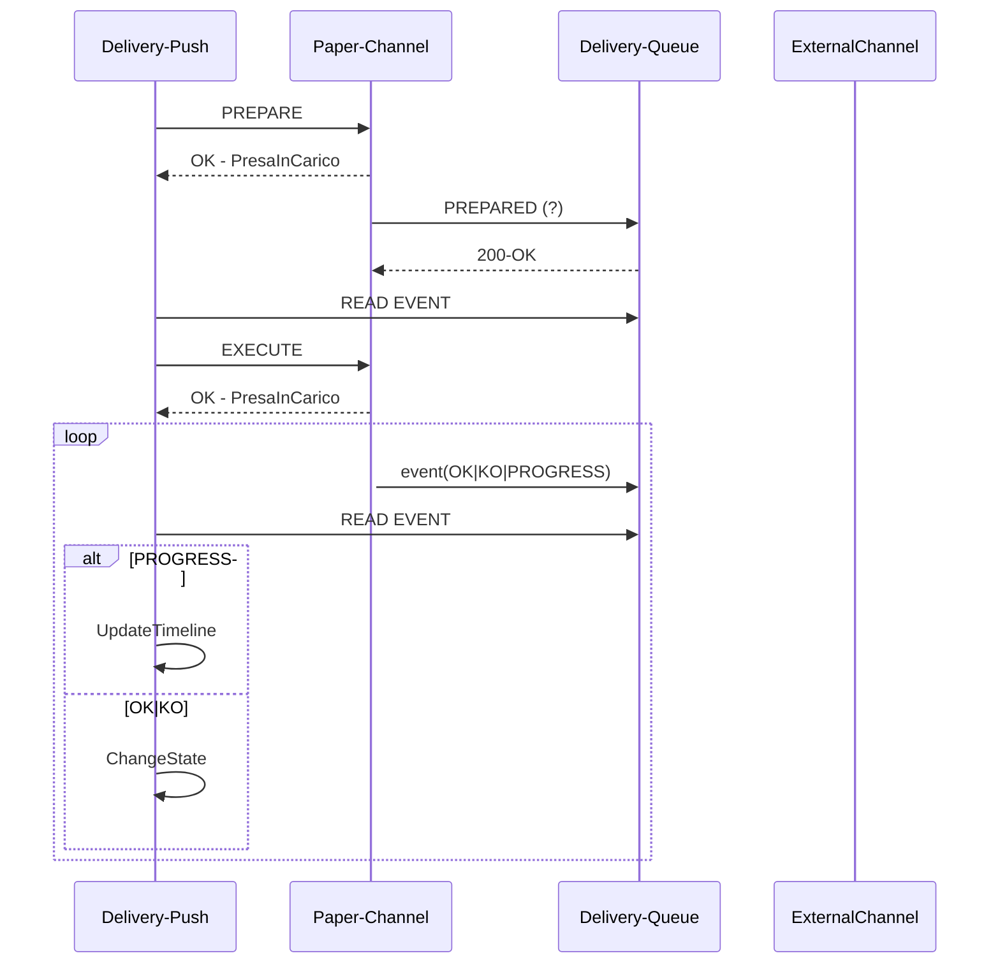

```mermaid
sequenceDiagram
    participant dp as Delivery-Push
    participant pc as Paper-Channel
    participant sqs as Delivery-Queue
    Participant ext as ExternalChannel

    dp ->> pc : PREPARE
    pc -->> dp : OK - PresaInCarico
    pc ->> sqs : PREPARED (?)

    sqs -->> pc : 200-OK
    dp ->> sqs : READ EVENT

    dp ->> pc : EXECUTE
    pc -->> dp : OK - PresaInCarico
    activate pc
    loop
        pc ->> sqs : event(OK|KO|PROGRESS)
        dp ->> sqs : READ EVENT
        alt PROGRESS
            dp ->> dp : UpdateTimeline
        else OK|KO
            dp ->> dp : ChangeState
        end
    end

```

