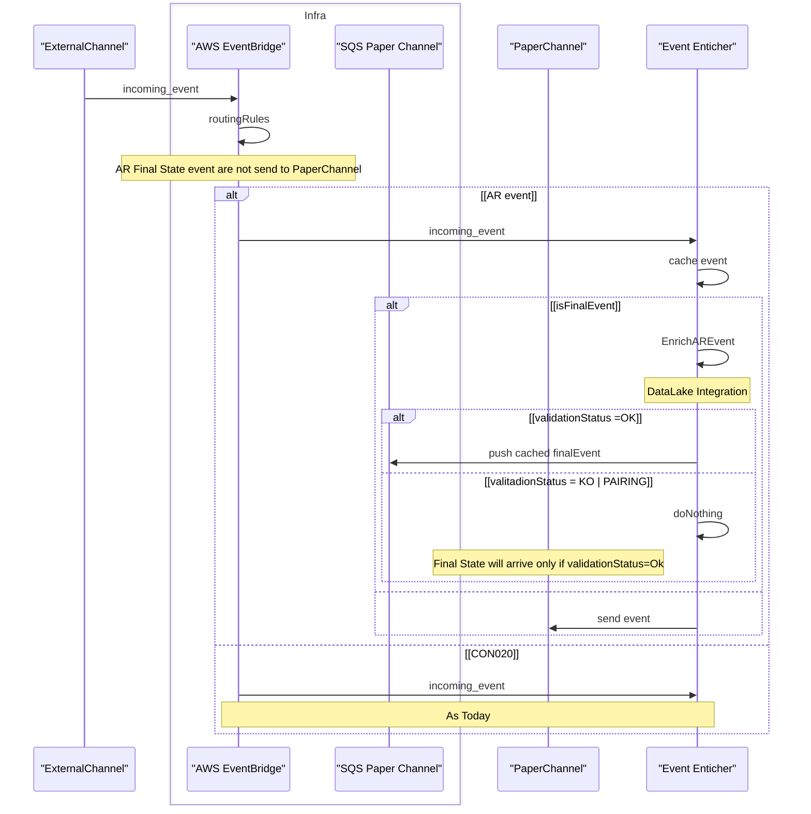

# SRS Soluzione 1 Diagramma logico 

Al fine di poter incorporare l'esito del servizio OCR nell'elaborazione degli eventi di postalizzazione.

- PaperChannel non riceverà più direttamente gli esiti finali da External-Channel ( con la mediazione di EventBridge ).
- Gli eventi AR verranno inviati parallelamente su EventEnricher il quale si occuperà di correlarli ed richiedere verifica al servizio OCR
- Sarà dunque Event Enricher ad inviare lo stato finale solo nei casi in cui l'esito del servizio OCR è positivo.

>[!WARNING]
> Questo comporta la macchina a stati della notifica rimarrà in progess fino a quando non saranno riscontrati positivamente i metadati 

> [!NOTE]
> **Lista degli Eventi Finali**
>| ProductType | DocumentType | Code | >Description| 
>| -------- | ------- | ------| ------|
>| AR| AR | RECRN001C| Fascicolo Chiuso
>| AR | Plico | RECRN002C| Mancata consegna - >Fascicolo Chiuso 
>| AR | Plico | RECRN002F |Irreperibilità >Assoluta - Fascicolo Chiuso 
>|AR | AR | RECRN003C | Consegnato presso >Punti di Giacenza -Fascicolo Chiuso 
>|AR|Plico|RECRN004C|Mancata consegna presso >Punti di Giacenza - Fascicolo Chiuso |
>|AR|Plico|RECRN005C |Compiuta giacenza - >Fascicolo Chiuso

